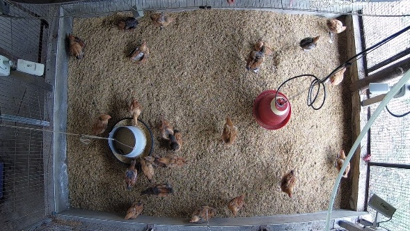
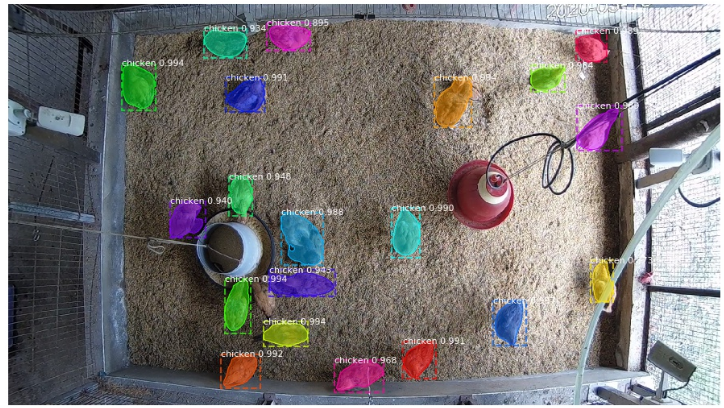
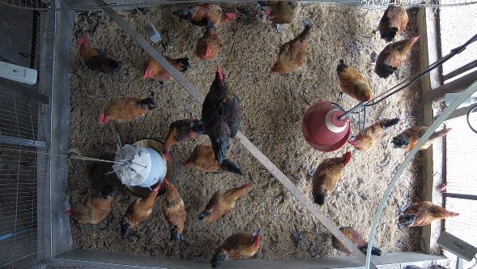
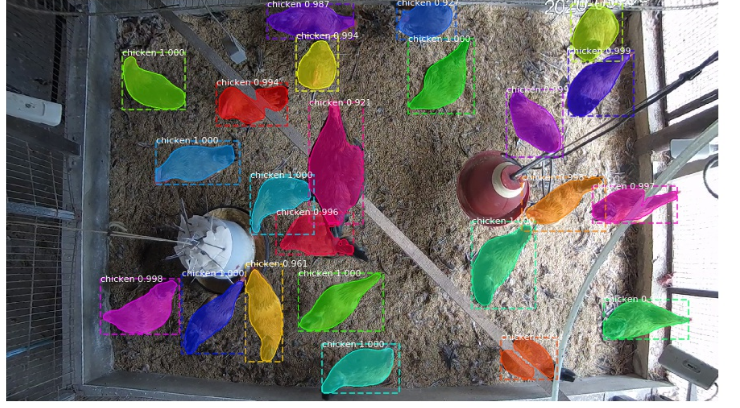

# ClumsyChickens

This repository implements a few backboned version of Mask R-CNN to detect broilers in poultry houses, and monitoring broilers's motion path using multiple object tracking by deep sort.

## backbone
* vgg16
* resnet101
* resnext101
* densenet121
* mobilenetV1
* mobilenetV2

## Getting started
>#### pipenv
    git clone https://github.com/AlexHsuYu/ClumsyChickens.git
    cd ClumsyChickens
    pipenv --python3.5
    pipenv -r requirements.txt
>#### train a new model starting from ImageNet weights
    python3 cockheads.py train --dataset=/path/to/dataset --subset=train --weights=imagenet
>#### train a new model starting from specific weights file
    python3 cockheads.py train --dataset=/path/to/dataset --subset=train --weights=/path/to/weights.h5
>#### test
    python3 cockheads.py detect --dataset=/path/to/datasets --subset=stage1_test --weights=/path/to/weight.h5
>#### average precision calculation
    python AP.py detect --weights=/path/to/weight.h5 --dataset=/path/to/datasets --subset=val
>#### vidoe demo
    python main.py

## results

>#### 6 week

  
  

>#### 14 week

  
  

>#### video demo

## License
ClumsyChickens is released under the MIT license. See the [LICENSE](/LICENSE) file for details.

